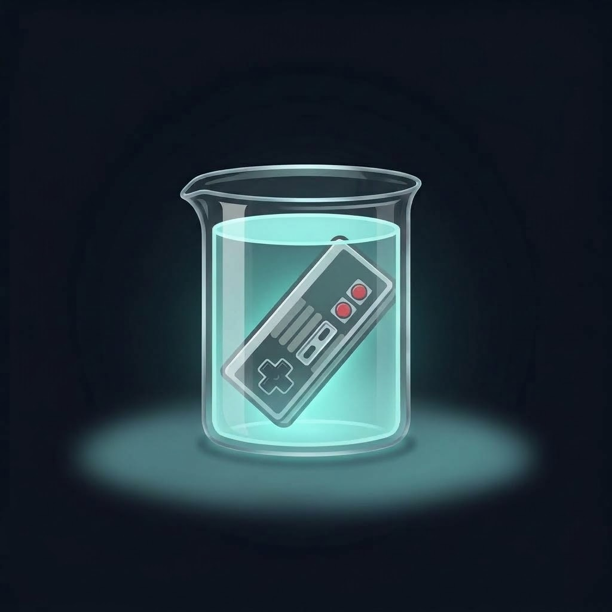

# Gamecraft Lab

**How game tech works — and how to build it.**

Video breakdowns of game mechanics and systems, open-source tools for players and developers, and Unity assets.

[YouTube](https://www.youtube.com/@gamecraftlaboratory)

---

## 🧰 Open-source software

Full applications you can download and use — developed in the open.

| Project | Description | Platforms | Status |
|---|---|---|---|
| Rewind | All-in-one retro game emulator frontend built on libretro | Windows, macOS, Linux, Android, iOS | In development |
| Xemu Manager | Game library manager and launcher for the xemu Original Xbox emulator | Windows, Linux, Steam Deck, macOS | In development |

## 🎬 Breakdowns

Each video takes a working implementation apart and explains the ideas behind it. The full source for every breakdown lives here.

| Project | Video | Description |
|---|---|---|
| *Coming soon* | | |

## 🛒 Unity Assets

| Project | Description | Status |
|---|---|---|
| Unified Inventory Framework | Modular inventory system for Unity | In development |

---

## Community rules

- Our projects never include or link to ROMs, BIOS files, firmware or games. Please dump your own from hardware you own.
- Issues asking for or linking to copyrighted files are closed and deleted.
- Be kind. Questions about how something works are always welcome.
